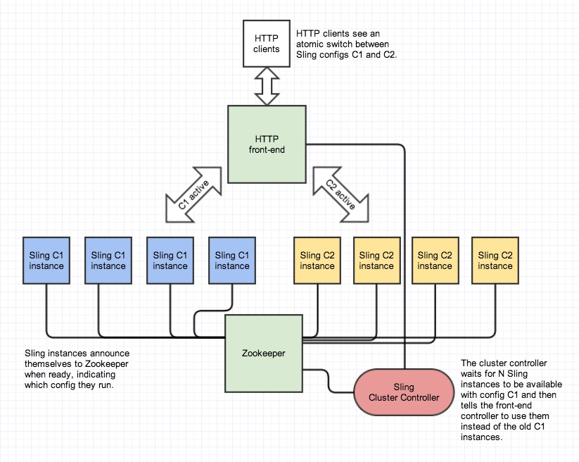

# Sling Devops Experiments - minimal cluster controller

This is the first of a series of experiments about how [Apache Sling](http://sling.apache.org)
 can be made more devops-friendly.

The goal of this experiment is to implement a simple cluster controller that detects available
Sling instances, and controls an HTTP load balancer front end to implement an atomic switch
between two Sling configurations C1 and C2.

The difference between C1 and C2 can be just a different rendering of /index.html for example,
the goal is only to verify that HTTP clients accessing the front-end see only C1 responses up
to a certain point in time, and only C2 responses after that, with continuous service during
the switch.

The attached diagram explains the scenario. To keep this experiment as simple as possible
we can start the Sling instances manually with the appropriate configs.



Each Sling instance announces itself to Zookeeper with its IP adress and port, indicating
which config it is running. A Sling StartupListener service can be used to trigger this
announce when Sling is ready.

The Sling instances can run on different hosts, as long as they can access Zookeeper and
as long as the front-end can access them.

The cluster controller first waits for N instances to be available with the C1 config, and
configures the load balancer to use those once they are available.

Later, we start N additional instances with the C2 config, which also announce themselves
to Zookeeper. 

When the cluster controller detects that N C2 instances are active, it reconfigures the
load balancer to switch to them atomically, so that front-end clients see only C2 responses
from this point on.

The C1 instances can then be shutdown, as soon as they are done processing any outstanding
requests.

To test the implementation, the HTTP clients should verify that they see an atomic switch
from C1 to C2 with no interruption.

## Implementation details

The component referred to as "cluster controller" above can be implemented simply as a
special Sling instance because it inherits all the benefits of Sling.

The prototype is therefore implemented as a collection of three Maven modules:
* `orchestrator`: component running on the cluster controller, referred to as the Orchestrator
* `minion`: component running on each individual Sling instance, referred to as a Minion
* `common`: contains classes shared between the implementations of the above two components

## Running

Notes:
* httpd, mod_proxy, and mod_proxy_balancer must be installed (maybe some other modules as well)
* httpd.conf must `Include` a separate config file inside its `<Proxy>` directive. This
separate config file will contain the `BalancerMember` list.
* To restart httpd usually a sudo password is required. It can be provided as a parameter
(below), or instead the sudoers file can be edited to include the following line:
  ```
  myuser	ALL=(ALL) NOPASSWD: /usr/sbin/apachectl
  ```
  where `myuser` is the username under which the Sling instance will be running (must have
administrative privileges) and `/usr/sbin/apachectl` must be updated appropriately.

Example httpd configuration:
```
Header add Set-Cookie "ROUTEID=.%{BALANCER_WORKER_ROUTE}e; path=/" env=BALANCER_ROUTE_CHANGED
<Proxy balancer://mycluster>
    Include /private/etc/apache2/mod_proxy_balancer.conf
    ProxySet stickysession=ROUTEID
</Proxy>

<Location />
    ProxyPass balancer://mycluster/
    ProxyPassReverse balancer://mycluster/
</Location>
ProxyPreserveHost On
ProxyRequests Off
```

The following system properties (passed via `-D` option of the `java` command) must be
available on the Sling instances:
* Minion
  * `sling.devops.zookeeper.connString`: ZooKeeper connection string (defaults to
`localhost:2181`)
  * `sling.devops.config`: config of the instance
* Orchestrator
  * `sling.devops.zookeeper.connString`: as above
  * `sling.devops.proxy.executable`: path to the httpd executable (defaults to `apachectl`)
  * `sling.devops.proxy.configPath`: path to the proxy config file as mentioned above
(defaults to `/private/etc/apache2/mod_proxy_balancer.conf`)
  * `sling.devops.orchestrator.n`: the parameter N (smallest number of instances that must
be running a new config before it is transitioned to; defaults to 2)
  * `sudo.password`: the sudo password, required if the `apachectl` restart requires sudo

ZooKeeper 3.3.6 and `common` bundles must be installed on all instances. `minion` bundle must
be installed on the Minion instances, and correspondingly the `orchestrator` bundle on the
Orchestrator instance. Everything then starts up and runs automatically:
* some information is printed in the log
* the information is exchanged via the `/sling` node in ZooKeeper
* the proxy config file is updated as soon as N Sling instances with the same config are available
